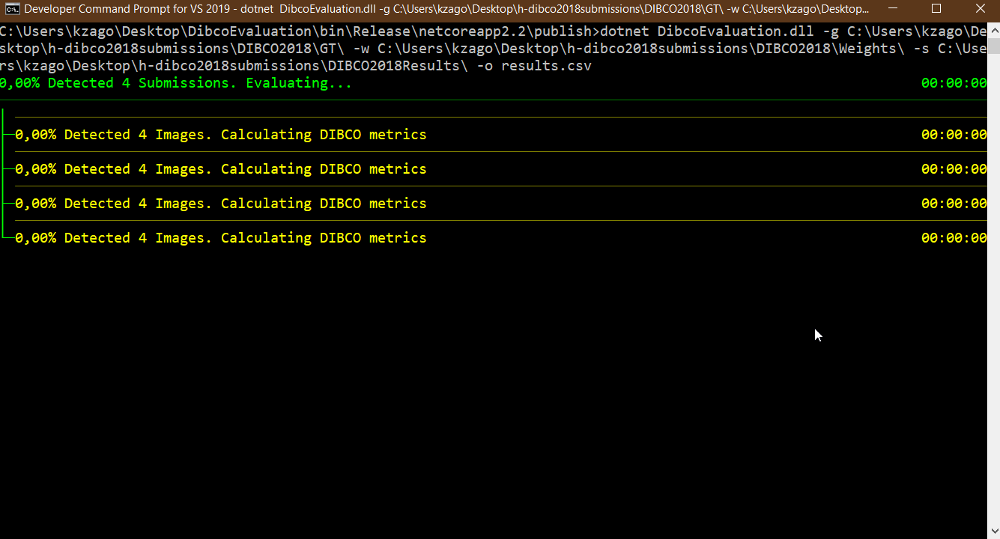

# Installation Instructions

## Running DIBCO Evaluation Tool



### Arguments

```text
  -s, --submissions    Required. Define the submissions' path. It must contain multiple folders (for each submission).

  -g, --gt             Required. The Ground Truth Image Files.

  -w, --weights        Required. The Path of the weights' directory of the ground truth image (required for evaluation) with the same name with the GT images.

  -o, --outputfile     Required. Write the results to a CSV compatible file.

  --detailedoutput     (Default: false) Produce a detailed scored for each metric for each submission for each ground-truth image.

  --perimagescore      (Default: true) Calculate the final score based on image position (DIBCO Competitions) instead of position on averages (H-DIBCO 2018)

  --help               Display this help screen.

  --version            Display version information.
```

## Prerequisites

### Matlab Runtime

1. Verify the MATLAB Compiler Runtime (MCR) is installed and ensure you have installed version MRC 9.4. You may download it from from [https://www.mathworks.com/products/compiler/matlab-runtime.html](https://www.mathworks.com/products/compiler/matlab-runtime.html)

### Dat Files

The executable BinEvalWeights.exe generates two .dat files containing the normalized distance weights for pseudo-Recall/Precision based on paper 1.

**Input:** Filename of the binary ground-truth image (supported formats of OpenCV ver.1).

**Output:** _\_RWeights.dat and _\_PWeights.dat

### DIBCO Metrics Tool

### Inputs

Filenames of:

1. GT image
2. Binarized image for evaluation
3. "Recall Weights" .dat file \*
4. "Precision Weights" .dat file \*

### Outputs

1. F-Measure
2. pseudo F-Measure (Fps)\*
3. PSNR
4. DRD

The outputs are CSV ';' delimited. For example (see `TestResources/`):

```powershell
.\DIBCO_metrics.exe .\5_gt.bmp .\5.bmp .\5_RWeights.dat .\5_PWeights.dat
```

produces the following output:

```text
F-Measure;pseudo F-Measure;PSNR;DRD
66.214;71.4372;14.5629;13.8647
```

\*Notice that for I.3 and I.4 a different executable program is required to generate the .dat files containing the "Recall/Precision weights". It is provided at `Prerequisites/BinEvalWeights` or at [http://users.iit.demokritos.gr/~kntir/TIP_exe/](http://users.iit.demokritos.gr/~kntir/TIP_exe/).\*\*

#### Usage

DIBCO_metrics.exe .\5_gt.bmp .\5.bmp .\5_RWeights.dat .\5_PWeights.dat

**CAUTION:** When providing the .dat files, always provide the "Recall weights" .dat file first and afterwards the "Precision weights" .dat file.

### References

1. K. Ntirogiannis, B. Gatos and I. Pratikakis, "Performance Evaluation Methodology for Historical Document Image Binarization", IEEE Trans. Image Proc., vol.22, no.2, pp. 595-609, Feb. 2013.

2. H.Lu, A.C. Kot and Y.Q. Shi, "Distance Reciprocal Distortion Measure for Binary Document Images", IEEE Sigal Proc. Lett., vol.11, no.2, pp. 228-231, Feb. 2004.
